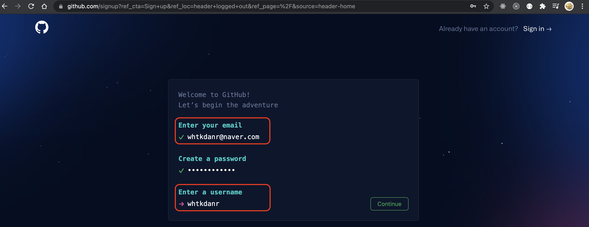
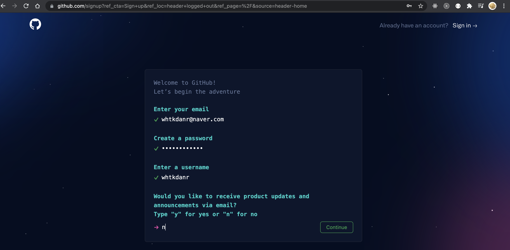
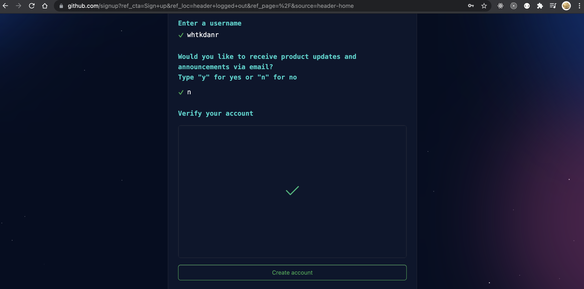
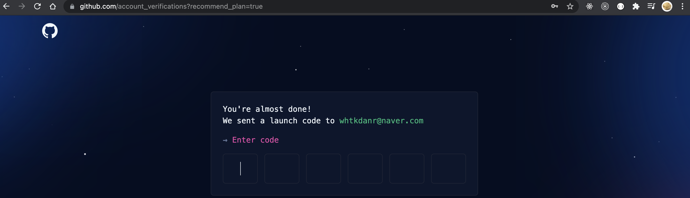
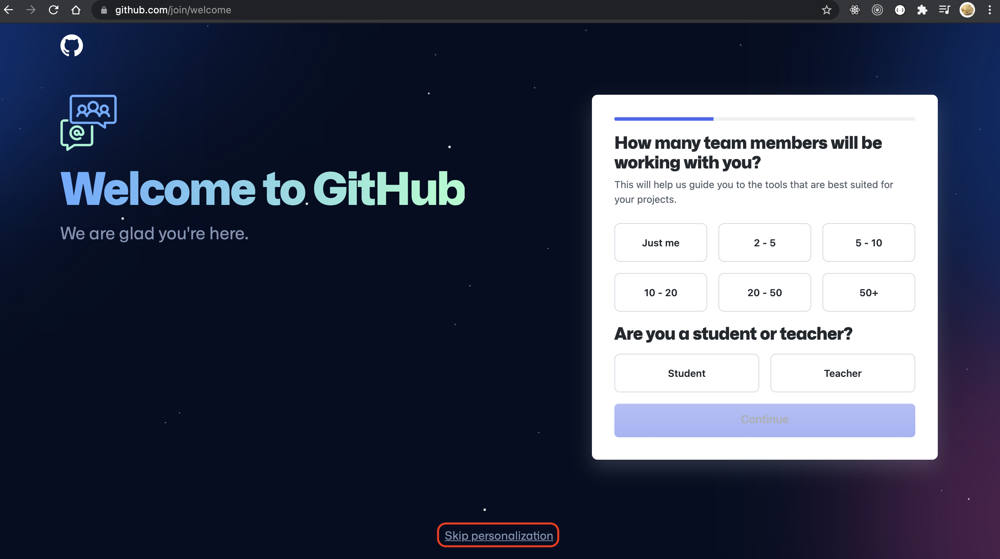
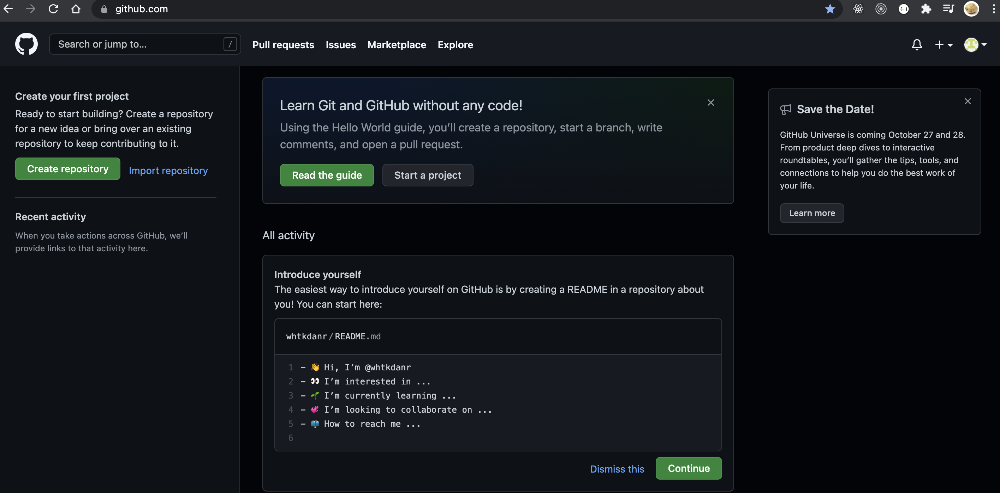
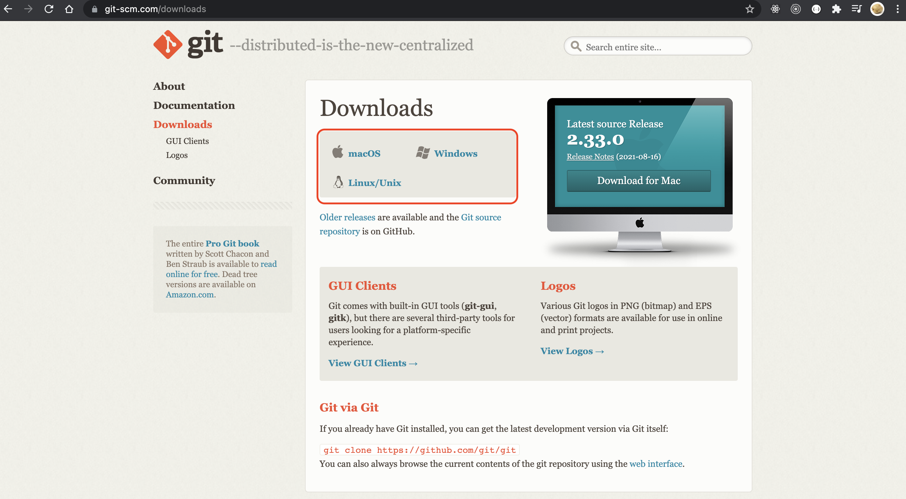
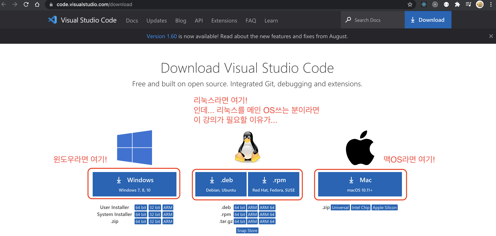

# 미리 작성하는 이력서 Git, 준비물

---------

해당 수업에서는 GitHub를 통해 나의 개발 이력을 관리하는 방법을 배울 예정입니다. 

안타깝게도 Git은 어려운 상당히 어려운 주제에 속하는 편입니다. 주어진 시간 내에 git의 설치 및 기타 필요한 프로그램을 설치하기에는 시간이 부족함으로 사전에 필요한 프로그램을 미리 준비해 주셨으면 합니다.

---------

## 1. gitHub 회원가입
- https://github.com/
 

위의 홈페이지를 방문하여 오른쪽 상단의 Sign Up을 클릭합니다.
 

 

여러분이 자주 사용하는 혹은 개발자 전용으로 사용하는 메일을 입력합니다. 해당 메일 주소로 사용자 증명이 필요하니 반드시 사용중인 메일을 입력하세요. 비밀번호 잘 설정 해주시고, 사용자 이름을 입력합니다.
 

 

상품 설명을 받겠냐는 질문인데 필요없으니 가뿐히 n으로 하고 넘어갑니다.
 

 

위대한 호모 사피엔스 사피엔스 임을 증명하고 계정을 생성합니다. 
 

 

맨처음 입력한 메일 주소 메일로 6자리 증명 코드가 있을 겁니다. 입력하고 다음으로 넘어갑니다.
 

 

이건 나중에 해도되는 하단의 skip을 통해 넘어갑니다. 그러면 우주 여행과 비슷한 화면을 보여줄겁니다. 
gitHub 계정 생성에 성공했으니 기쁜 마음으로 친구들에게 자랑합니다. 
  
  

---------

## 2. git 설치
- https://git-scm.com/downloads
 

위의 웹페이지를 방문하여 각자 운영 체제에 맞는 실행 파일을 다운로드하고 실핼해 주시기 바랍니다. 
여러 가지 설치에 필요한 설정이 나타나지만 전부 무시하고 Next 혹은 다음을 눌러 설치합니다. 
보통의 경우 64bit 윈도우를 설치해주시면 됩니다.
  

윈도우에서 "git bash"을 검색하여 실행하고, "git --version"를 입력했을때, 
버전이 나오면 제대로 설치된 것 입니다.

혹시나 몰라서 도움이 될만한 링크를 남겨놓습니다. 
- https://goddaehee.tistory.com/216

---------

## 3. VSCode 설치
- https://code.visualstudio.com/download
 

마이크로소프트의 선물이라고 불리는 VSCode를 설치해 줍니다. 
VSCode는 코드 편집기로 다양한 편의 기능을 제공함으로 있으면 매우 편하고 좋지만, 
다른 편집기를 사용하셔도 됩니다.
  

-----

## 여기까지 설치해주신 분은 이제 제가 진행하는 강의를 잘 따라와 주시면 됩니다.
